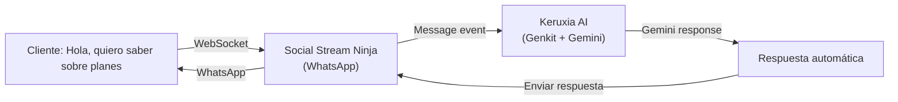

# 🚀 Social Stream Ninja - Integración Keruxia

## Descripción General

Social Stream Ninja es una plataforma de comunicación multi-canal en tiempo real que integra 120+ canales (WhatsApp, Email, Telegram, Discord, Slack, LinkedIn, Twitter, etc.) en un único agente IA.

**Para Keruxia**: Permite que el agente IA responda a clientes automáticamente a través de múltiples canales de forma simultánea.

---

## 📋 Tabla de Contenidos

1. [Setup Inicial](#setup-inicial)
2. [Configuración](#configuración)
3. [API Endpoints](#api-endpoints)
4. [Ejemplos de Uso](#ejemplos-de-uso)
5. [Troubleshooting](#troubleshooting)

---

## 🔧 Setup Inicial

### 1. Obtener Session ID

1. Ir a [Social Stream Ninja](https://ninja.streamyard.com) (requiere cuenta)
2. Crear un Stream
3. En **Settings** → **API** → Copiar **Session ID**
4. Pegar en `.env.local`:

```env
SOCIAL_STREAM_SESSION_ID=your_session_id_here
```

### 2. Conectar Canales

En Social Stream Dashboard:

- **WhatsApp**: Conectar mediante QR o Business API
- **Email**: Agregar IMAP/SMTP credentials
- **Telegram**: Crear bot y agregar token
- **Discord**: Crear webhook
- **LinkedIn, Twitter, Instagram**: Agregar API keys

### 3. Inicializar el Agente en Keruxia

```bash
# Iniciar el servidor
npm run dev

# En otra terminal, inicializar el agente
curl -X POST http://localhost:9003/api/social-stream/init \
  -H "Content-Type: application/json"
```

---

## ⚙️ Configuración

### Variables de Entorno

```env
# Requerido
SOCIAL_STREAM_SESSION_ID=your_session_id_here

# Opcional (con defaults)
SOCIAL_STREAM_BASE_URL=https://io.socialstream.ninja
SOCIAL_STREAM_IN_CHANNEL=4      # Canal de entrada (chat del stream)
SOCIAL_STREAM_OUT_CHANNEL=2     # Canal de salida (dock/respuestas)

# Firestore (para persistencia de mensajes)
FIREBASE_PROJECT_ID=your_project_id
NEXT_PUBLIC_FIREBASE_PROJECT_ID=your_project_id

# Google AI
GOOGLE_GENAI_API_KEY=your_google_genai_api_key_here
```

---

## 🔌 API Endpoints

### POST /api/social-stream/init

Inicializar el agente IA.

**Request:**
```bash
curl -X POST http://localhost:9003/api/social-stream/init \
  -H "Content-Type: application/json"
```

**Response:**
```json
{
  "status": "initialized",
  "message": "Social Stream Agent is listening for incoming messages",
  "config": {
    "sessionId": "abc123def...",
    "inChannel": 4,
    "outChannel": 2
  }
}
```

---

### POST /api/social-stream/send

Enviar mensaje a través de Social Stream.

**Request:**
```bash
curl -X POST http://localhost:9003/api/social-stream/send \
  -H "Content-Type: application/json" \
  -d '{
    "message": "Hola, ¿en qué puedo ayudarte?",
    "username": "client@example.com",
    "platform": "whatsapp"
  }'
```

**Response:**
```json
{
  "status": "sent",
  "message": "Message sent through Social Stream",
  "details": {
    "to": "client@example.com",
    "platform": "whatsapp"
  }
}
```

**Parámetros:**
- `message` (string, requerido): Mensaje a enviar
- `username` (string, opcional): Destinatario (default: "all")
- `platform` (string, opcional): Canal (whatsapp, email, telegram, discord, etc.)

---

### POST /api/social-stream/block

Bloquear a un usuario.

**Request:**
```bash
curl -X POST http://localhost:9003/api/social-stream/block \
  -H "Content-Type: application/json" \
  -d '{
    "username": "spammer123",
    "platform": "discord"
  }'
```

**Response:**
```json
{
  "status": "blocked",
  "message": "User spammer123 blocked on discord"
}
```

---

### POST /api/social-stream/command

Enviar comando raw a Social Stream.

**Request:**
```bash
curl -X POST http://localhost:9003/api/social-stream/command \
  -H "Content-Type: application/json" \
  -d '{
    "action": "clearAll"
  }'
```

**Comandos disponibles:**
- `clearAll`: Limpiar todos los mensajes
- `nextInQueue`: Featured siguiente mensaje
- `emoteonly toggle`: Activar/desactivar solo emotes

---

### GET /api/social-stream/status

Obtener estado de la conexión.

**Request:**
```bash
curl http://localhost:9003/api/social-stream/status
```

**Response:**
```json
{
  "status": "success",
  "data": {
    "connected": true,
    "sessionId": "abc123def...",
    "bufferedMessages": 0,
    "reconnectAttempts": 0
  }
}
```

---

### GET /api/social-stream/messages

Obtener historial de mensajes.

**Request:**
```bash
curl http://localhost:9003/api/social-stream/messages?limit=50
```

**Response:**
```json
{
  "status": "success",
  "data": {
    "count": 10,
    "messages": [
      {
        "chatname": "user123",
        "chatmessage": "Hola",
        "type": "whatsapp",
        "timestamp": 1711270800000
      }
    ]
  }
}
```

---

### GET /api/social-stream/health

Health check de la conexión.

**Request:**
```bash
curl http://localhost:9003/api/social-stream/health
```

**Response (Connected):**
```json
{
  "status": "healthy",
  "connected": true,
  "reconnectAttempts": 0
}
```

---

### DELETE /api/social-stream/close

Cerrar conexión.

**Request:**
```bash
curl -X DELETE http://localhost:9003/api/social-stream/close
```

**Response:**
```json
{
  "status": "closed",
  "message": "Social Stream connection closed"
}
```

---

## 💡 Ejemplos de Uso

### Ejemplo 1: Cliente envía WhatsApp → Agente responde automáticamente



**Flow:**
1. Cliente envía: "Hola, quiero saber sobre planes"
2. Social Stream recibe mensaje via WhatsApp
3. Keruxia AI (`generateAIResponse`) procesa el mensaje
4. Genera respuesta con Gemini 1.5 Pro
5. Envía respuesta automáticamente a WhatsApp

### Ejemplo 2: Multi-canal (Cliente en Telegram, responder en Email)

```bash
# Client envía en Telegram
# Keruxia recibe y procesa
# Responde en Email con copias en CRM
```

---

## 🛠️ Troubleshooting

### Problema: "SOCIAL_STREAM_SESSION_ID not configured"

**Solución:**
1. Ir a Social Stream Ninja → Settings → API
2. Copiar Session ID
3. Agregar a `.env.local`:
   ```env
   SOCIAL_STREAM_SESSION_ID=abc123def456
   ```
4. Reiniciar servidor: `npm run dev`

---

### Problema: "Failed to connect to Social Stream"

**Posibles causas:**
- Session ID expirado
- Firewall bloqueando WebSocket
- Base URL incorrecta

**Solución:**
1. Verificar Session ID es correcto
2. Probar conexión manualmente:
   ```bash
   curl https://io.socialstream.ninja/api/status
   ```
3. Revisar logs: `GET /api/social-stream/health`

---

### Problema: Mensajes no se envían

**Checklist:**
1. ¿Agente inicializado? → `GET /api/social-stream/status`
2. ¿Conexión activa? → Debe mostrar `connected: true`
3. ¿Firestore configurado? → Para persistencia
4. ¿API key de Gemini válida? → Para generar respuestas

---

## 📚 Archivos Principales

| Archivo | Descripción |
|---------|-------------|
| `src/lib/social-stream-config.ts` | Configuración de Social Stream |
| `src/ai/flows/social-stream-agent.ts` | Agente IA principal + WebSocket |
| `src/app/api/social-stream/route.ts` | API REST endpoints |
| `.env.local` | Variables de entorno |

---

## 🔐 Seguridad

### Recomendaciones:

1. **Session ID**: Nunca commitear a GitHub
   ```bash
   # En .gitignore
   .env.local
   credentials.json
   ```

2. **API Keys**: Usar secret management
   ```bash
   # En producción, guardar en Google Secret Manager
   gcloud secrets create SOCIAL_STREAM_SESSION_ID
   ```

3. **Validación de mensajes**: Anti-spam, profanidad

4. **Rate limiting**: 30 mensajes/minuto por usuario

---

## 📊 Monitoreo

### Métricas a trackear:

```javascript
// En Firestore
db.collection('social_stream_metrics').add({
  timestamp: new Date(),
  totalMessages: count,
  channelBreakdown: {
    whatsapp: 45,
    email: 23,
    telegram: 12,
    discord: 8,
  },
  averageResponseTime: 1250, // ms
  errorRate: 0.02, // 2%
});
```

---

## 🚀 Próximos Pasos

1. ✅ Setup inicial completo
2. ✅ Conectar primeros 2-3 canales
3. ⏳ Entrenar agente IA con ejemplos
4. ⏳ Integrar con Firestore para persistencia
5. ⏳ Agregar moderación automática
6. ⏳ Dashboard de analytics

---

## 📖 Más Información

- [Social Stream Ninja Docs](https://docs.socialstream.ninja)
- [Genkit Documentation](https://firebase.google.com/docs/genkit)
- [Keruxia Integration Guide](./SOCIAL_STREAM_SETUP_GUIDE.md)
